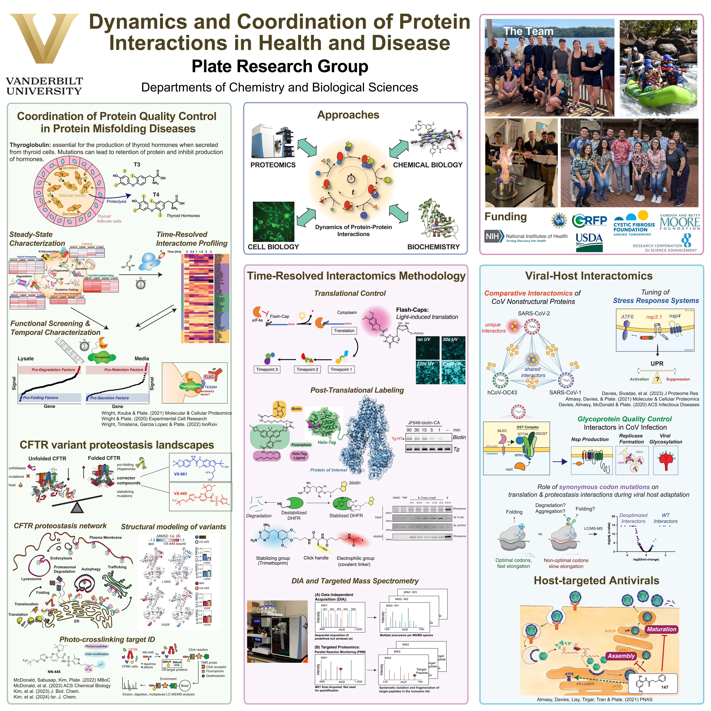

# 🌟 Plate Lab GitHub Repository

Welcome to the Plate Lab GitHub repository! Here, you will find code, data, and documentation related to our research. We are part of the Departments of Chemistry and Biological Sciences at Vanderbilt University in Nashville, Tennessee.

For contact info, please refer to our [website](https://www.plate-research.org/contact.html).

## 🏢 About Our Research

The focus of the group is to define the dynamics and the coordination of protein interaction networks in diverse cellular processes. Towards this goal, we develop new mass spectrometry-based proteomics and chemical biology tools. Dynamic protein-protein interactions govern many molecular, cellular, and organismal processes and altered interactions are intricately linked to disease states. For instance, in cancer disparate protein-protein interactions occur in signal transduction pathways, protein folding diseases arise from aberrant engagement of protein folding pathways, and pathogenic infections take advantage of host-pathogen protein interactions that co-opt cellular pathways. Our goal is to understand how protein interactions in the pertinent biological processes have to be properly timed and coordinated. Defining the pathological consequences of mistimed and uncoordinated protein interactions on disease states will then guide the identification of new therapeutic strategies.

Publications: [Link](https://www.plate-research.org/publications.html)

<!-- ## 📂 Repositories

### [Repository 1 Name](link-to-repo)
- **Description**: Brief description of the repository.
- **Tech Stack**: Technologies used (e.g., Python, R, MATLAB).

### [Repository 2 Name](link-to-repo)
- **Description**: Brief description of the repository.
- **Tech Stack**: Technologies used (e.g., Python, R, MATLAB).

### [Repository 3 Name](link-to-repo)
- **Description**: Brief description of the repository.
- **Tech Stack**: Technologies used (e.g., Python, R, MATLAB).

## 🚀 Getting Started

To get started with our projects, please refer to the README file in each repository. There you will find detailed instructions on setting up and using the code, as well as any required dependencies.

## 🤝 Contributing

We welcome contributions from the research community. If you are interested in contributing, please follow these steps:

1. Fork the repository.
2. Create a new branch (`git checkout -b feature-branch`).
3. Make your changes and commit them (`git commit -m 'Add new feature'`).
4. Push to the branch (`git push origin feature-branch`).
5. Open a pull request.

Please refer to our [CONTRIBUTING.md](link-to-contributing.md) file for more detailed guidelines.

-->

